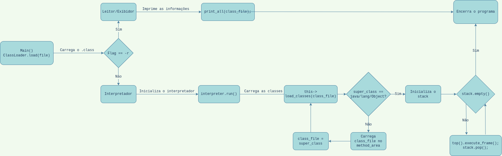

# JVM-8
Projeto da disciplina de Software Básico 2021/2 - Universidade de Brasília

[Repositório GitHub](https://github.com/luizschonarth/JVM-8/)

## [Wiki do Projeto](https://luizschonarth.github.io/JVM-8/)



## Integrantes
- Gustavo Tomás de Paula
- Luiz Carlos Schonarth Junior
- Rafael Henrique Nogalha de Lima
- Tong Zhou

## TL;DR
Compilar: `$ make -f Makefile.win`  
Exibidor: `$ ./jvm.exe -r ./examples/<nome_da_classe>.class`  
Interpretador: `$ ./jvm.exe ./examples/<nome_da_classe>.class`  
Docs: `$ doxygen Doxyfile` (`docs/index.html`)

## Dependências
Para compilar e rodar o código, é necessário ter o `make` e o `g++ -std=c++11` instalados. Opcionalmente, o `Doxygen` para gerar a documentação. 

## Compilar
Para compilar o programa, basta utilizar `$ make -f Makefile.win` (para Windows) ou `$ make -f Makefile.lin` (para Linux) e uma pasta `build` será gerada.

## Interpretador
Para rodar o programa no mode interpretador, basta usar o comando de acordo com o sistema operacional:

- Linux: ```$ ./jvm ./examples/<nome_da_classe>.class```

- Windows: ```$ ./jvm.exe ./examples/<nome_da_classe>.class```

## Exibidor
Para rodar o programa no modo leitor, basta usar o mesmo comando do interpretador, com a flag `-r`:

- Linux: ```$ ./jvm -r ./examples/<nome_da_classe>.class```

- Windows: ```$ ./jvm.exe -r ./examples/<nome_da_classe>.class```

Um arquivo do tipo markdown (`.md`) será gerado com as informações do `.class` fornecido. Os arquivos gerados podem ser encontrados na pasta `/out/`.

__Atenção para o interpretador__  
É preciso que todas as classes chamadas pela classe executada estejam no diretório `/examples/`. Caso contrário o interpretador não irá funcionar corretamente.

## Limpar
Depois de executar o programa, basta executar `$ make clean -f Makefile.win` para deletar os arquivos gerados (arquivos objetos e executáveis).

## Documentação
É possível gerar uma página HTML com a documentação do código. Para isso, basta utilizar o comando `$ doxygen Doxyfile` (é preciso ter o doxygen instalado). Então, basta abrir na pasta docs o arquivo `index.html` no navegador, que ele irá te direcionar à página.
